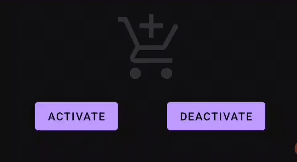
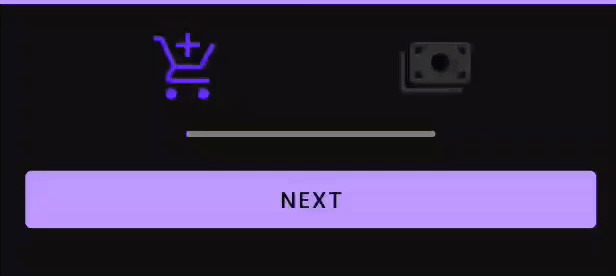

# Dynamic MotionLayout bar
Example of MotionLayout created programmatically

# Before you start
To read and possibly understand this code, you need to know the basics of MotionLayout and how to create a custom view to be used in XML. The project, to keep it simple, is not created with production code in mind meaning that resources are not extracted, code lacks style management etc.

# Example 1
ActivableImageView - custom imageView that changes alpha and color upon activation

# Example 2
XML created motion layout that uses ActivableImageView from Example 1

# Example 3
StepProgressBarView - custom view with steps to show progress

